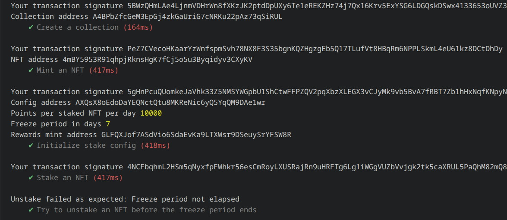

# NFT Staking with Metaplex Core

A Solana staking protocol built with Anchor that enables NFT staking without transferring custody of assets. Instead of moving NFTs into a vault account, staking is implemented directly on the asset using Metaplex Core plugins.

The NFT remains in the user's wallet throughout the staking lifecycle while the program manages staking state, freezing controls, and reward distribution.

---

## Overview

Traditional NFT staking systems often require users to transfer assets into escrow or vault accounts. This project follows a different approach.

Using Metaplex Core's plugin architecture:

* Assets remain in the owner's wallet
* NFTs become non-transferable while staked
* Staking metadata is stored directly on the asset
* Rewards are distributed through a dedicated SPL token mint
* Rewards can be claimed without unstaking
* Unstaking only mints any rewards that remain unclaimed

This approach minimizes custody risks while preserving a familiar staking experience.

---

## Architecture

### Collection Authority

Each collection is created with a program-derived update authority.

```text
PDA:
["update_authority", collection]
```

This PDA manages plugin updates and staking-related asset modifications.

### Staking Configuration

Every collection has an independent staking configuration account.

```text
PDA:
["config", collection]
```

The configuration stores:

| Parameter     | Purpose                  |
| ------------- | ------------------------ |
| rewards_bps   | Daily reward rate        |
| freeze_period | Minimum staking duration |
| rewards_bump  | Rewards mint PDA bump    |
| bump          | Config PDA bump          |

### Rewards Mint

Each collection receives a dedicated reward token mint.

```text
PDA:
["rewards_mint", config]
```

Reward tokens are minted during successful unstaking operations.
The collection also tracks its live staked NFT total using an Attributes plugin.

---

## Staking Lifecycle

### 1. Collection Creation

The program creates an MPL Core collection and assigns update authority to the staking PDA.

Result:

* Collection created
* Program gains collection control
* Future assets can participate in staking

---

### 2. Asset Minting

NFTs are minted directly into the collection.

Result:

* Asset belongs to collection
* Asset becomes eligible for staking

---

### 3. Stake

When a user stakes an NFT:

#### Freeze Delegate Plugin

A freeze delegate plugin is attached and activated.

```text
frozen = true
```

This prevents transfers while staking is active.

#### Attributes Plugin

Metadata is stored directly on the asset:

```text
staked = true
staked_at = <unix_timestamp>
rewards_updated_at = <unix_timestamp>
```

Result:

* NFT remains in owner's wallet
* Transfers are disabled
* Staking timer begins
* Collection `staked_count` is incremented

---

### 4. Claim Rewards

Users can claim accrued rewards without unstaking the NFT.

Result:

* NFT remains staked and frozen
* Rewards are minted for completed staking days since the last reward update
* `rewards_updated_at` is refreshed

---

### 5. Unstake

The program validates:

* Asset is currently staked
* Required freeze duration has elapsed

If successful:

#### Asset Update

```text
frozen = false
staked = false
staked_at = 0
rewards_updated_at = 0
```

#### Reward Distribution

Reward tokens are minted to the owner's associated token account only for any days not already claimed.

Result:

* NFT becomes transferable again
* User receives any remaining staking rewards
* Collection `staked_count` is decremented

---

## Reward Calculation

Rewards scale linearly with staking duration.

Formula:

```text
rewards =
(staked_days × rewards_bps × 10^decimals)
/ 10000
```

Where:

| Variable    | Meaning                           |
| ----------- | --------------------------------- |
| staked_days | Number of completed staking days since the last reward update |
| rewards_bps | Daily reward rate in basis points |
| decimals    | Reward token mint decimals        |

---

## Program Instructions

### initialize

Creates:

* Collection staking configuration
* Reward token mint

### create_collection

Creates a Metaplex Core collection controlled by the staking program.

### mint_asset

Mints an NFT into the managed collection.

### stake

Activates staking for an NFT by:

* Freezing the asset
* Recording staking metadata
* Incrementing the collection `staked_count`

### claim

Mints rewards without unstaking by keeping `staked_at` unchanged and only advancing the reward accrual timestamp.

### unstake

Completes staking by:

* Removing freeze restrictions
* Minting any remaining unclaimed rewards
* Resetting staking metadata
* Decrementing the collection `staked_count`

---

## PDA Reference

| PDA              | Seeds                              |
| ---------------- | ---------------------------------- |
| Config           | `["config", collection]`           |
| Rewards Mint     | `["rewards_mint", config]`         |
| Update Authority | `["update_authority", collection]` |

---

## Program Information

### Program ID

```text
5gCkmBQZT5Xn4qreRirUwDUS5WqRMXi2j5pkf3PN7Mu
```


## Local Development

### Requirements

* Rust
* Solana CLI
* Anchor CLI 0.31.1
* Node.js
* Yarn
* Surfpool

---

### Build

```bash
anchor build
```

---

### Start Surfpool

```bash
surfpool start
```

---

### Run Tests

```bash
anchor test --skip-local-validator
```

The test suite uses Surfpool's time-travel functionality to simulate freeze-period expiration.

---

## Example Test Flow

```text
Create Collection
        │
        ▼
Mint NFT
        │
        ▼
Initialize Config
        │
        ▼
Stake NFT
        │
        ▼
Attempt Early Unstake
        │
        ▼
Expected Failure
        │
        ▼
Advance Time
        │
        ▼
Successful Unstake
        │
        ▼
Rewards Minted
```

---
